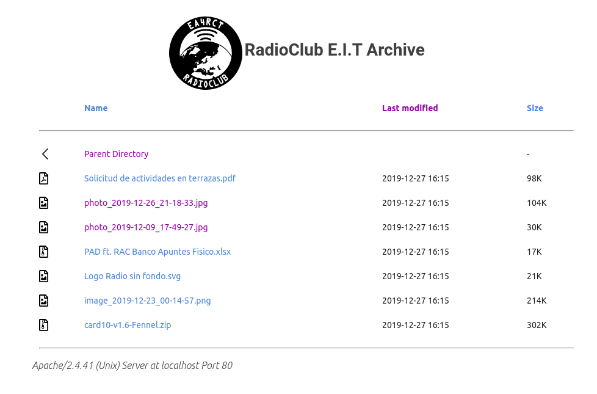

## Alpine microcontainer with Apache2 and FTP

Based on [Docker-alpine-ftp-server](https://github.com/delfer/docker-alpine-ftp-server) and [Docker-alpine-apache](https://github.com/nimmis/docker-alpine-apache).

This is a micro docker container based on Alpine OS, Apache version 2 and vsftpd. The aim of this project is to create a public FTP accessible from Apache2, used for public science archives.

There images are build on [nimmis/alpine-micro](https://hub.docker.com/r/nimmis/alpine-micro/)  which are a modified version of Alpine OS with a working init process, cron, logrotate  and syslog. All services are started by runit daemon, for more information about how it works and setup of new services please visit <https://hub.docker.com/r/nimmis/alpine-micro/> for more information.

The container also have a backup system with cron schedule, number of copies to save etc, for information about the backup system please visit the [README.md for the backupsystem](https://github.com/nimmis/backup/blob/master/README.md)


#### starting the container as a daemon

```
docker run -d --rm --name apache-ftp-server \
					-p 80:80 \
					-p 21:21 \
	        -p 21000-21010:21000-21010 \
	        -e USERS="one|1234" \
	        -e ADDRESS=localhost \
	        acien101/alpine-apache-ftp-server
```

This will start the container with apache and vsftpd process running, to access the container use

```
	docker exec -ti apache-ftp-server /bin/sh
```
---

## FTP Configuration

Environment variables:
- `USERS` - space and `|` separated list (optional, default: `ftp|alpineftp`)
  - format `name1|password1|[folder1][|uid1] name2|password2|[folder2][|uid2]`
- `ADDRESS` - external address witch clients can connect passive ports (optional)
- `MIN_PORT` - minamal port number may be used for passive connections (optional, default `21000`)
- `MAX_PORT` - maximal port number may be used for passive connections (optional, default `21010`)

## USERS examples

- `user|password foo|bar|/home/foo`
- `user|password|/home/user/dir|10000`
- `user|password||10000`

---


